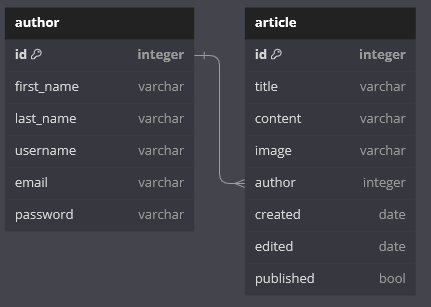

# nilsmf Backend

The backend of my website is powered by Rust and the Actix web framework. This combination ensures a robust and efficient server-side architecture for delivering a seamless user experience.

## Why make a backend?

One of the first things I do when starting a new project, is finding reasons _not_ to do it. This is mainly because I always have several ongoing projects, but also because I find it more motivating working on a project, if there are good reasons for its existance.

So, why do I need a backend?
I could just use one of the many web-hotels out there.
But that would only showcase my lacking design capabilities, and not my fullstack development.
And creating a website, makes it easier too showcase my capablities too non-it-folk, since I can show the website.
And for people who are interested in it, I can bug them with a lot of uneeded information.

So, I need a backend, now I just need to find out what I need to make this project succeed.

## Initial Attempt with Django

At the outset, I experimented with Django as the backend, employing an SQLite database. My initial concept was to display each "project" as an "article," with each article being stored in the database. However, the schema I used contained unnecessary complexity for a one-person project, including an "author" field. While the choice of Django was driven by my preference for Python and the need for a database, I realized that it provided more functionality than necessary for this specific website.

## Transition to Rust and Actix

I returned to the project with a newfound interest in learning Rust. After extensive research, I discovered [Actix](https://actix.rs/) and [rusqlite](https://github.com/rusqlite/rusqlite) as essential crates for the job. Actix became the framework for managing endpoints, while rusqlite allowed me to efficiently manage the database.

### Improved Database Schema




I identified several issues with my previous attempt, primarily related to image handling and differentiation. In the new schema, I can store articles (references to markdown files) along with all associated images. This enhancement offers flexibility in managing multiple images associated with articles, and a tag system distinguishes between different images and articles. The improved schema also tracks when an article was last edited and whether it's marked as "created."

### Image Endpoint

To display images, I needed a method to serve them from the backend. I achieved this by storing the image filenames in the database and creating an endpoint for image retrieval:

```rust
#[get("/image/{file}")]
async fn get_image(path: web::Path<String>) -> impl Responder {
    let file_path = String::from("./images/".to_string() + &path.into_inner());

    if let Ok(res) = web::block(|| std::fs::read(file_path)).await {
        if let Ok(con) = res {
            return HttpResponse::Ok()
                .content_type("image/png")
                .body(con);
        }
    }
    HttpResponse::NotFound().body("File not found")
}
```

For further details about the project, you can visit my [GitHub repository](https://github.com/Neelzee/nilsmf-backend).
