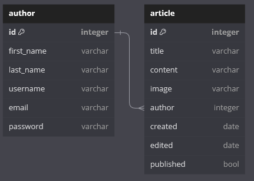

# nilsmf Backend

The backend of my website is powered by Rust and the Actix web framework. This combination ensures a robust and efficient server-side architecture for delivering a seamless user experience.


## Why make a backend?

One of the first things I do when starting a new project, is finding reasons _not_ to do it. This is mainly because I always have several ongoing projects, but also because I find it more motivating working on a project, if there are good reasons for its existance.

So, why do I need a backend?
I could just use one of the many web-hotels out there.
But that would only showcase my lacking design capabilities, and not my fullstack development.
And creating a website, makes it easier too showcase my capablities too non-it-folk, since I can show the website.
And for people who are interested in it, I can bug them with a lot of uneeded information.

So, I need a backend, now I just need to find out what I need to make this project succeed.


### Scope

I wanted to be able to use what I learned in making this project, and the code, for other projects.
This I knew from the start. So I decided to over engineer the application.
I wanted this website to be a way to talk about my projects, so I decided on having this:



As you can see in the schema above, I wanted to be able to have several authors. Even though this is a personal website, and was unnecessary, it would be usefull for [other](/projects/gnf) projects.
My backend needed some way to authenticate these authors, since I did not want unauthorized users to create or delete articles.
So, since I liked Python, I landed on Django.


### Initial Attempt with Django

Using Django as a framework for my backend, was really fun. It did a lot of work for me, like managing the database, I did not have to write a single SQL-query.
I could do everything using Python.

My first hurdle, was every self learned web-developers encounter, when they split up their frontend and backend into different applications. CORS.

I spent several days wrangling with outdated documents and answers from ChatGPT that did not work, until I figured it out. All I had too do, was these lines:

```python
INSTALLED_APPS = [
    ...,
    "corsheaders"
]


MIDDLEWARE = [
    ...,
    'corsheaders.middleware.CorsMiddleware'
]

CORS_ORIGIN_WHITELIST = (
    '*'
)

CORS_ALLOWED_ORIGINS = [
    "*"
]

CORS_ALLOW_METHODS = [
    "DELETE",
    "GET",
    "OPTIONS",
    "PATCH",
    "POST",
    "PUT"
]

CORS_ALLOW_CREDENTIALS = True
```

A lot of probably unnecessary and unsecure allowances, but I wanted to continue on. I also did not figure out what finally allowed me to send request from the frontend to the backend, since I added all of these at once.
But it worked.

My second hurdle, was authentication. I attempted to piggyback on Django's admin user authentication, and just having all authors be admin users, but I could not find a way to do this securly.
At the same time I wanted too use CSRF-tokens, since I've _heard_ they are secure, I did not know why.

But I spent several days on this aswell, without figuring it out, and eventually gave up,
blaming work and exams taking up too much of my freetime.


### Transition to Rust and Actix

I returned to the project with a newfound interest in learning Rust. I had used it a few times, in smaller projects. It's really fun too use, and one of my favourite things about it, is the `Option<T>`
and `Result<T, E>` monads. Not having to deal with nullpointer exceptions, is a dream come true.

After extensive research, ~~asking ChatGPT~~, I discovered [Actix](https://actix.rs/).


### Improved Database Schema

I identified several issues with my previous attempt, primarily related to image handling and differentiation. In my old design, an article could only have a single image, which is not enough to display an entire project.
So my new plan was to use markdown files as my articles. That way, I could give the frontend people (me),
the job in rendering both the document and file, and just worry about creating the needed endpoints in retriving them.

In the new schema, I have no schema. The best database, is no database.
All markdown files are in a folder, called `markdown`, and this endpoint:

```rust
#[get("/article/{file}")]
async fn get_file(path: web::Path<String>) -> impl Responder {
    let file_path = path.into_inner();

    let res: Result<String, io::Error> = async {
        let fp = String::from("./markdown/".to_string() + &file_path);
        let mut file = File::open(fp)?;
        let mut contents = String::new();

        file.read_to_string(&mut contents)?;

        Ok(contents)
    }.await;

    if let Ok(con) = res {
        return HttpResponse::Ok()
            .insert_header(("Content-Type", "text/markdown"))
            .body(con);
    }

    HttpResponse::NotFound().body("File not found")
}
```

Ensures that any article can be retrieved. I can piggyback on my servers authentication system, and not worry about people writing or deleting my articles, since I am the only one with access to the server that runs the backend.

I also created an endpoint for retrieving images, which looks like this:

```rust
#[get("/images/{file}")]
pub async fn get_image(path: web::Path<String>) -> impl Responder {
    let file_path = String::from("./images/".to_string() + &path.into_inner());

    if let Ok(res) = std::fs::read(file_path) {
        return HttpResponse::Ok()
            .insert_header(("Access-Control-Allow-Origin", "*"))
            .content_type("image/png")
            .body(res);
    }

    HttpResponse::NotFound().insert_header(("Access-Control-Allow-Origin", "*")).body("File not found")
```

I need this endpoint, because when I write these articles, I use a relative-url, which doesnt relate to the frontend. So in the frontend, I render this:

```markdown

```

as this:

```html

```

And I can now have as many images as I want in my articles, and where ever I want.

And now the project has everything it needs. Now all that's left, is the [frontend](/projects/frontend)

For further details about the project, you can visit my [GitHub repository](https://github.com/Neelzee/nilsmf-backend).
